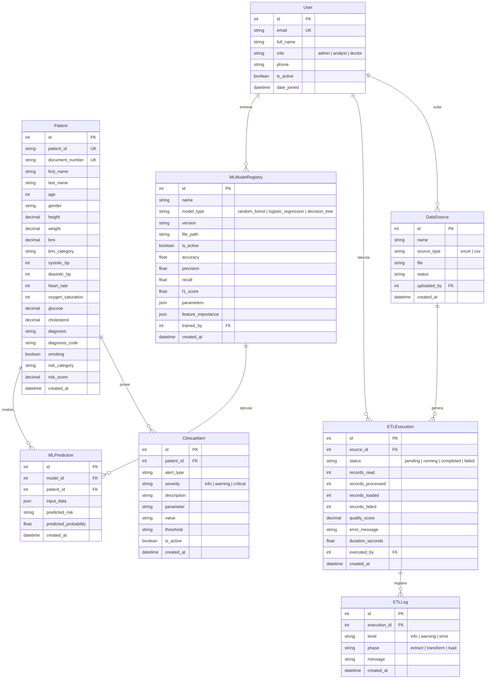

# Documentación Técnica - HealthAnalytics IPS

HealthAnalytics IPS es una plataforma empresarial e inteligente de analítica clínica, diseñada con una arquitectura desacoplada para procesar, transformar, analizar y predecir riesgos médicos a partir de datos clínicos de pacientes.

---

## 1. Arquitectura del Sistema

La solución sigue principios de **Clean Architecture**, **SOLID** y **separación de responsabilidades por módulos** tanto en el Backend como en el Frontend.

```
                    ┌───────────────────────────┐
                    │     Frontend (Next.js)    │
                    │   React + Tailwind + TS   │
                    └─────────────┬─────────────┘
                                  │
                                  │ (JWT over HTTPS)
                                  ▼
                    ┌───────────────────────────┐
                    │      Backend (DRF)        │
                    │   Django REST Framework   │
                    └──────┬─────────────┬──────┘
                           │             │
              (Postgresql) │             │ (In-Memory / Synchronous Fallback)
                           ▼             ▼
                     ┌───────────┐ ┌───────────┐
                     │ Neon DB   │ │ Celery/   │
                     │  (Cloud)  │ │   Redis   │
                     └───────────┘ └───────────┘
```

### Backend (Python 3.12 + Django REST Framework)
Organizado en aplicaciones Django independientes:
- **`apps.authentication`**: Gestión de usuarios, roles, JWT y perfil.
- **`apps.patients`**: Gestión CRUD de pacientes y detección de pacientes críticos/alertas clínicas.
- **`apps.etl`**: Extracción, transformación y carga independiente de archivos Excel y CSV.
- **`apps.analytics`**: Cálculo de estadísticas descriptivas avanzadas y correlaciones de variables.
- **`apps.ml`**: Motor de Machine Learning para entrenamiento y predicciones (Scikit-Learn).
- **`apps.reports`**: Generación de reportes ejecutivos y exportación multiformato.
- **`core`**: Middleware de auditoría, manejo centralizado de excepciones y control de acceso basado en roles (RBAC).
- **`etl_engine`**: Motor desacoplado del pipeline de ETL (Extractor, Transformer, Loader).

### Frontend (Next.js 14 + TypeScript + Tailwind CSS + Shadcn UI)
Basado en App Router y estructurado de la siguiente forma:
- **`src/app`**: Páginas y componentes de ruta de la aplicación.
- **`src/components`**: Componentes visuales organizados (UI, layout, dashboard).
- **`src/hooks`**: Hooks personalizados como `useAuth` para control de estado de sesión y permisos.
- **`src/lib`**: Funciones auxiliares (`api.ts` y `utils.ts`).
- **`src/types`**: Tipos e interfaces fuertes de TypeScript para todo el modelo de datos.

---

## 2. Modelo Entidad-Relación (Mermaid)

El siguiente diagrama detalla las tablas principales de la base de datos PostgreSQL y sus relaciones.



---

## 3. Matriz de Control de Acceso por Roles (RBAC)

El acceso al sistema está restringido y auditado por medio del middleware de Django y del hook `useAuth` del Frontend.

| Módulo / Permiso | Administrador (`admin`) | Analista (`analyst`) | Médico (`doctor`) |
| :--- | :---: | :---: | :---: |
| **Dashboard** | Lectura / Escritura | Lectura | Lectura |
| **Pacientes (CRUD)** | CRUD Completo | Solo Lectura | Solo Lectura |
| **ETL - Carga e Historial** | Ejecutar / Eliminar | Ejecutar | Sin Acceso |
| **Machine Learning (Entrenar)** | Entrenar y Guardar | Entrenar y Guardar | Sin Acceso |
| **Machine Learning (Predecir)** | Ejecutar | Ejecutar | Ejecutar (Lectura) |
| **Reportes Ejecutivos** | Generar / Exportar | Sin Acceso | Solo Lectura |
| **Configuración y Usuarios** | CRUD de Usuarios | Sin Acceso | Solo Perfil |

---

## 4. Estructura de Endpoints de la API

La API REST del backend está totalmente documentada con OpenAPI y accesible mediante Swagger.

### Autenticación y Usuarios
- `POST /api/v1/auth/login/` - Iniciar sesión (retorna token JWT y datos de usuario).
- `POST /api/v1/auth/logout/` - Cerrar sesión e invalidar tokens.
- `GET /api/v1/auth/profile/` - Obtener perfil del usuario autenticado.
- `GET/POST /api/v1/auth/users/` - Listar y crear usuarios del sistema (solo Admin).
- `GET/PUT/PATCH/DELETE /api/v1/auth/users/<id>/` - Detalle y gestión de usuario específico.

### Pacientes
- `GET/POST /api/v1/patients/` - Listar pacientes (con filtros y ordenamiento avanzados) o crear paciente.
- `GET/PUT/PATCH/DELETE /api/v1/patients/<id>/` - Obtener, actualizar o eliminar un paciente.
- `POST /api/v1/patients/bulk_upload/` - Carga masiva directa de archivos.
- `GET /api/v1/patients/critical/` - Listar pacientes detectados como críticos.
- `GET /api/v1/patients/stats/` - KPIs resumidos de pacientes.
- `POST /api/v1/patients/export/` - Exportar lista de pacientes en CSV o XLSX.

### Procesos ETL
- `GET/POST /api/v1/etl/sources/` - Gestión de fuentes de datos.
- `POST /api/v1/etl/sources/upload/` - Subir un nuevo archivo clínico.
- `POST /api/v1/etl/executions/execute/` - Ejecutar la transformación y carga clínica (soporta sincrónico/asincrónico).
- `GET /api/v1/etl/executions/history/` - Historial de procesos de carga.

### Analítica Avanzada
- `GET /api/v1/analytics/stats/` - Estadísticas y promedios poblacionales (incluyendo Media, Mediana, Moda y Desviación Estándar).
- `GET /api/v1/analytics/correlations/` - Matriz de correlación de Pearson para variables clínicas.
- `GET /api/v1/analytics/trends/` - Tendencias temporales de calidad de ETL y distribución de riesgo por edad.

### Machine Learning
- `POST /api/v1/ml/models/train/` - Entrenar y evaluar Random Forest, Regresión Logística y Árbol de Decisión.
- `POST /api/v1/ml/models/predict/` - Evaluar y predecir el riesgo de enfermedad de un paciente.
- `GET /api/v1/ml/models/comparison/` - Obtener tabla comparativa de métricas de precisión de los modelos.

### Reportes
- `GET /api/v1/reports/executive/` - Resumen ejecutivo consolidado del estado clínico poblacional.
- `GET /api/v1/reports/export/<report_type>/` - Descargar reportes en PDF, CSV o JSON.
